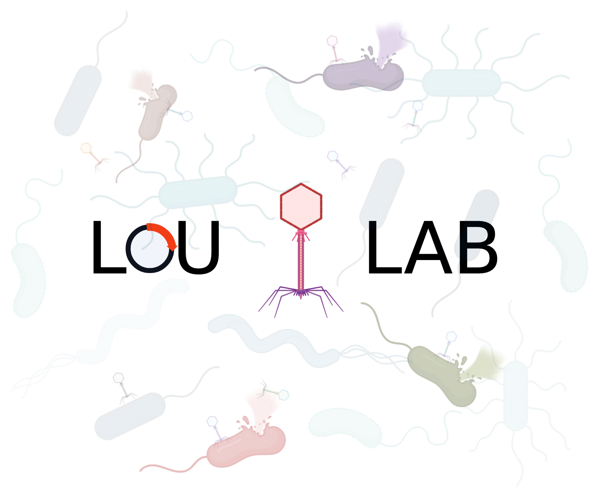

# Phage Activation Project


## Overview
This project involves genomic analysis for phage activation. It includes scripts to analyze genome sequences using tools like MEME, Needle, and BLASTP.

## Installation

### Create a Python Environment
To create a new Python environment named `Phage_design` and install the necessary packages, follow these steps:

```sh
# Create a new conda environment
conda create -n Phage_design python=3.9

# Activate the environment
conda activate Phage_design
```

### Install Python Dependencies
To install the necessary Python dependencies, run:

```sh
pip install -r requirements.txt
```

### Install External Tools
This project requires the following external tools:
1. **MEME Suite**: For motif-based sequence analysis.
2. **Needle**: For sequence alignment.
3. **BLASTP**: For protein-protein sequence alignment.

#### Installing MEME Suite
To install MEME Suite, follow these steps:

```sh
# Download and extract MEME Suite
wget http://meme-suite.org/meme-software/5.4.1/meme-5.4.1.tar.gz
tar -zxvf meme-5.4.1.tar.gz
cd meme-5.4.1

# Configure and install
./configure --prefix=/usr/local
make
sudo make install
```

#### Installing Needle
To install Needle, follow these steps:

```sh
# On Debian/Ubuntu
sudo apt-get update
sudo apt-get install emboss

# On CentOS/RHEL
sudo yum install epel-release
sudo yum install emboss
```

After downloading Needle, move it to `/usr/bin/`:

```sh
sudo mv needle /usr/bin/
```

#### Installing BLASTP
To install BLASTP, follow these steps:

```sh
# Download BLAST+
wget https://ftp.ncbi.nlm.nih.gov/blast/executables/blast+/2.11.0/ncbi-blast-2.11.0+-x64-linux.tar.gz
tar -zxvf ncbi-blast-2.11.0+-x64-linux.tar.gz
cd ncbi-blast-2.11.0+

# Add BLAST+ to PATH
export PATH=$PATH:$PWD/bin
```
#### Installing Prokka
Prokka is a software tool for the rapid annotation of prokaryotic genomes.

To install Prokka, follow these steps:

1. **Using Conda (recommended)**

   If you have Conda installed, you can easily install Prokka using the Bioconda channel:

   ```sh
   conda install -c conda-forge -c bioconda prokka
   ```
#### Installing CD-HIT
```sh
# Download CD-HIT
wget https://github.com/weizhongli/cdhit/releases/download/V4.8.1/cd-hit-v4.8.1-2019-0228.tar.gz
tar -zxvf cd-hit-v4.8.1-2019-0228.tar.gz
cd cd-hit-v4.8.1-2019-0228

# Compile and install
make
sudo cp cd-hit /usr/local/bin
sudo cp cd-hit-est /usr/local/bin
```
## Usage

To run the phage activation analysis, use the following command:

```sh
python phage_design.py -gbk_path <path_to_gbk_file> -output_dir <output_directory>
```
## Example
```sh
python phage_design.py -gbk_path test_data/KX897981.gbk -output_dir test_data/
```
